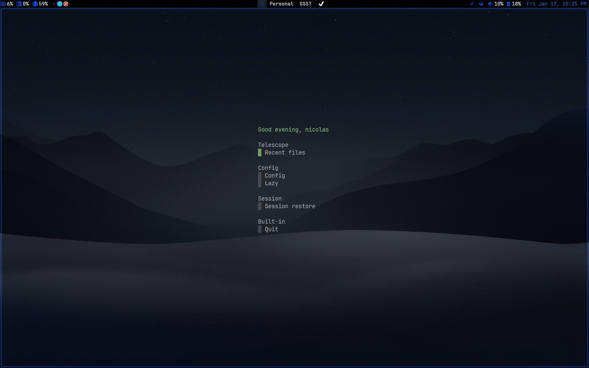

# My Neovim Config


## Description

My neovim config based on [LazyVim](https://www.lazyvim.org), with added plugins
to extend its functionality.

If you don't understand how this works, you probably shouldn't use this
configuration. First check out kickstart.nvim and understand how plugins,
keymaps, LSPs, and the rest of the config works. Or just start with LazyVim like
I did.

  
  
  

The configuration is structured so that:

1) Vim specific configurations are in the
  `./lua/config/` folder (keymaps, settings, auto commands, lazy plugin manager
  setup) in the same way preconfigured LazyVim is structured, and

2) All plugin configurations are in the `./lua/plugins/` folder, with each
plugin having its own file named similarly to the name of the plugin as
opposed to a modularized configuration that groups all related plugins in larger
files called `ui.lua`, `editor.lua`, etc. This way, removing a plugin is as
simple as deleting its file. This also makes editing the configuration easier
because the LSP doesn't have to read a massive lua file whenever I want to edit
a plugin config. See below:

<details>
  <summary><b>File Structure</b></summary>

```
.
├── ftplugin
│  └── java.lua
├── lua
│  ├── config
│  │  ├── autocmds.lua
│  │  ├── keymaps.lua
│  │  ├── lazy.lua
│  │  └── options.lua
│  └── plugins
│     ├── {allplugins}.lua
│     └── ...
├── init.lua
├── lazyvim.json
└── README.md
```

</details>


## Interesting Things

My favorite things about this configuration are (in no particular order):

* the 90% of [LazyVim](https://www.lazyvim.org) that I don't have disabled
* every single one of the things in `./lua/config/keymaps.lua`
* the ~25 ms startup time (more like 60ms in regular Windows)
  * see the last 2 auto commands in [here](./lua/config/autocmds.lua) if you use WSL
* these plugins:
  * [spider](https://github.com/chrisgrieser/nvim-spider) (better `w`, `e`, and `b`)
  * [mini.files](https://github.com/echasnovski/mini.files) (less intrusive version of oil.nvim)
  * [indent scope](https://github.com/echasnovski/mini.indentscope) (with an instant animation)
  * [one dark pro](https://github.com/olimorris/onedarkpro.nvim) (transparent + italic comments)
  * [highlight undo](https://github.com/tzachar/highlight-undo.nvim) (very nice)
  * [code_runner](https://github.com/CRAG666/code_runner.nvim) (very very nice)
  * [better term](https://github.com/CRAG666/betterTerm.nvim) (super nice)
  * [flatten.nvim](https://github.com/willothy/flatten.nvim) (*amazing* when used with better term and autojump)
* LSP and formatter support for R-markdown, C++, Java, and Python (mostly thanks to LazyVim)
  * see `./lua/plugins/markdown.lua` and `./lua/plugins/markdowntable.lua` for an amazing markdown editing experience

> [!Note]
> Many of the plugins I use are not visible in `lua/plugins/` because I use the
> lazyvim configuration which already comes with lots of plugins. You can see
> these in the [LazyVim repo](https://github.com/LazyVim/LazyVim). I also have
> disabled some plugins that come with LazyVim in the `overrides.lua` file.

To use this configuration (I don't recommend this, make your own)(it probably
won't fully work for you anyway)(you're better off starting your own config and
stealing the chunks that you actually need), just clone the repo into your
`~/.config/nvim` folder. If you don't know how to do that, you shouldn't be
using this in the first place.

If you're using Windows, stop. Use WSL and be happy.

## TODO

- [x] Fix transparent completion window
- [x] Edit Treesitter highlighting for markdown checkboxes
- [ ] transparent Lualine?
